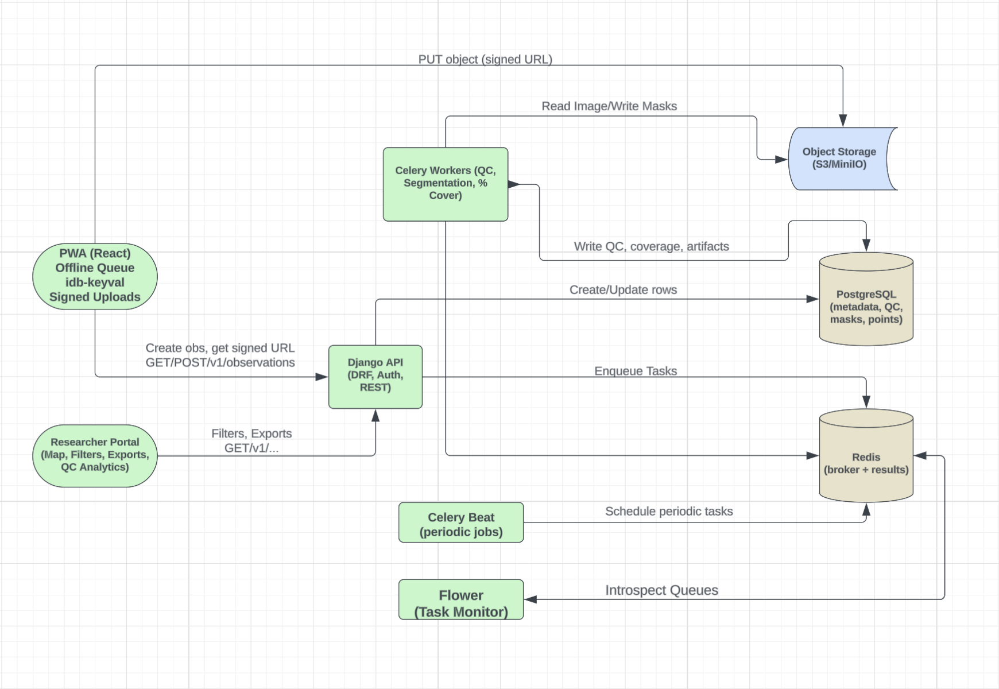

# HyacinthWatch

HyacinthWatch is a citizen-science system for monitoring the spread of invasive water hyacinth. It combines a progressive web app (PWA) for offline field data collection with a backend pipeline for image quality control, segmentation, and coverage estimation, plus a researcher portal for visualization and ecological analysis.

## Table of Contents

- [Overview](#overview)
- [Architecture](#architecture)
- [Components](#components)
- [Quick Start](#quick-start)
- [Development](#development)
- [Deployment](#deployment)
- [Documentation](#documentation)
- [Contributing](#contributing)
- [License](#license)

## Overview

HyacinthWatch enables citizens and researchers to:
- **Collect observations** in the field using a mobile-friendly PWA that works offline
- **Automatically analyze images** using ML models for presence detection and segmentation
- **Visualize and analyze data** through a researcher portal with analytics and export capabilities
- **Track contributions** through a gamification system that awards points for quality observations

### Key Features

- 📱 **Progressive Web App (PWA)** - Works offline, installable on mobile devices
- 🤖 **ML-Powered Analysis** - Automatic presence detection and segmentation using PyTorch models
- 📊 **Quality Control** - Automated QC scoring for image quality assessment
- 🎮 **Gamification** - Points and levels to encourage quality contributions
- 🔐 **Authentication** - Supabase JWT-based authentication
- 📈 **Analytics** - Researcher portal with charts, filters, and data export
- 🐳 **Dockerized** - Containerized deployment with Docker Compose

## Architecture



<!-- Alternative ASCII diagram (kept as fallback or remove if using image above)
```
┌─────────────────┐
│   PWA (React)   │  ← Field data collection (offline-capable)
└────────┬────────┘
         │ HTTP/REST
         ▼
┌─────────────────┐
│  Django Backend │  ← API server (Gunicorn)
└────────┬────────┘
         │
         ├─→ Redis (Celery broker)
         │
         └─→ Celery Workers ─→ ML Models (PyTorch)
                              ├─ Presence Detection
                              └─ Segmentation
         │
         ▼
┌─────────────────┐
│   PostgreSQL    │  ← Database
└─────────────────┘

┌─────────────────┐
│  Researcher     │  ← Data visualization & analysis
│  Portal (React) │
└─────────────────┘

┌─────────────────┐
│   Supabase      │  ← Storage (images, masks, models)
│   Storage       │     Authentication
└─────────────────┘
```
-->

### Data Flow

1. **Upload**: User uploads photo via PWA → Backend API
2. **Storage**: Image saved to local filesystem and optionally uploaded to Supabase Storage
3. **Processing**: Celery tasks enqueued for:
   - Presence classification (MobileNetV2)
   - Segmentation (U-Net)
   - Quality control scoring
4. **Gamification**: Points awarded based on detection results
5. **Visualization**: Researcher portal queries processed observations

See [WORKFLOW.md](./WORKFLOW.md) for detailed workflow documentation.

## Components

### 1. Backend (`/backend`)
Django REST API with Celery workers for ML inference.

- **Framework**: Django 4.2 + Django REST Framework
- **Task Queue**: Celery + Redis
- **ML Models**: PyTorch (MobileNetV2, U-Net)
- **Database**: PostgreSQL
- **Storage**: Supabase Storage (optional)

See [backend/README.md](./backend/README.md) for details.

### 2. PWA (`/hyacinthwatch-pwa`)
React-based Progressive Web App for field data collection.

- **Framework**: React 19
- **Maps**: Leaflet
- **Storage**: IndexedDB (offline)
- **Auth**: Supabase

See [hyacinthwatch-pwa/README.md](./hyacinthwatch-pwa/README.md) for details.

### 3. Researcher Portal (`/researcher-portal`)
React application for data analysis and visualization.

- **Framework**: React 19 + Tailwind CSS
- **State Management**: Zustand
- **Data Fetching**: TanStack Query
- **Charts**: Recharts

See [researcher-portal/README.md](./researcher-portal/README.md) for details.

### 4. Infrastructure (`/infra`)
Docker Compose configuration for local development and deployment.

See [infra/README.md](./infra/README.md) for details.

### 5. Research (`/research`)
Jupyter notebooks and scripts for model training and evaluation.

See [research/README.md](./research/README.md) for details.

## Quick Start

### Prerequisites

- Docker and Docker Compose
- Node.js 18+ (for local frontend development)
- Python 3.10+ (for local backend development)
- PostgreSQL (or use Docker)
- Redis (or use Docker)

### Option 1: Docker Compose (Recommended)

1. **Clone the repository**
   ```bash
   git clone <repository-url>
   cd HyacinthWatch
   ```

2. **Configure environment variables**
   ```bash
   cd backend
   cp .env.example .env.docker
   # Edit .env.docker with your Supabase credentials
   ```

3. **Start services**
   ```bash
   cd infra
   docker-compose up -d
   ```

4. **Access services**
   - Backend API: http://localhost:8000
   - Redis: localhost:6379
   - PWA: http://localhost:3000 (if running locally)
   - Researcher Portal: http://localhost:3001 (if running locally)

### Option 2: Local Development

See component-specific READMEs for detailed setup instructions:
- [backend/README.md](./backend/README.md)
- [hyacinthwatch-pwa/README.md](./hyacinthwatch-pwa/README.md)
- [researcher-portal/README.md](./researcher-portal/README.md)

## Development

### Project Structure

```
HyacinthWatch/
├── backend/              # Django backend API
│   ├── hyacinthwatch/    # Django project settings
│   ├── observations/     # Main app (models, views, tasks)
│   ├── workers/          # Celery worker tasks
│   └── utils/            # Utilities (storage, etc.)
├── hyacinthwatch-pwa/    # PWA frontend
├── researcher-portal/    # Researcher portal frontend
├── infra/                # Docker Compose configs
├── research/             # ML training notebooks
├── models/               # Trained model weights (local)
└── scripts/              # Utility scripts
```

### Environment Variables

Key environment variables (see component READMEs for complete lists):

**Backend:**
- `DATABASE_URL` - PostgreSQL connection string
- `SUPABASE_URL` - Supabase project URL
- `SUPABASE_SERVICE_ROLE_KEY` - Supabase service role key
- `CELERY_BROKER_URL` - Redis connection URL

**Frontend:**
- `REACT_APP_API_BASE_URL` - Backend API URL
- `REACT_APP_SUPABASE_URL` - Supabase URL
- `REACT_APP_SUPABASE_ANON_KEY` - Supabase anonymous key

### Running Tests

```bash
# Backend tests
cd backend
python manage.py test

# Frontend tests (PWA)
cd hyacinthwatch-pwa
npm test

# Frontend tests (Researcher Portal)
cd researcher-portal
npm test
```

### Code Style

- **Python**: Follow PEP 8, use Black for formatting (if configured)
- **JavaScript**: ESLint configuration included in React projects
- **Git**: Follow conventional commit messages

## Deployment

### Production Considerations

1. **Security**
   - Set `DEBUG=False` in Django settings
   - Use strong `SECRET_KEY`
   - Configure `ALLOWED_HOSTS`
   - Enable HTTPS
   - Secure Redis and PostgreSQL

2. **Performance**
   - Use production WSGI server (Gunicorn)
   - Configure Celery workers with appropriate concurrency
   - Enable database connection pooling
   - Use CDN for static files

3. **Monitoring**
   - Set up logging aggregation
   - Monitor Celery task queue
   - Track ML model performance
   - Monitor database performance

4. **Storage**
   - Configure Supabase Storage buckets
   - Set up model versioning in Supabase Storage
   - Configure image retention policies

See [infra/README.md](./infra/README.md) for deployment details.

## Documentation

- [WORKFLOW.md](./WORKFLOW.md) - Detailed photo upload and processing workflow
- [TODO.md](./TODO.md) - Known issues and TODOs
- [backend/README.md](./backend/README.md) - Backend API documentation
- [hyacinthwatch-pwa/README.md](./hyacinthwatch-pwa/README.md) - PWA documentation
- [researcher-portal/README.md](./researcher-portal/README.md) - Researcher portal documentation
- [infra/README.md](./infra/README.md) - Infrastructure and deployment guide

## Contributing

1. **Fork the repository**
2. **Create a feature branch** (`git checkout -b feature/amazing-feature`)
3. **Make your changes** following code style guidelines
4. **Write tests** for new functionality
5. **Commit your changes** (`git commit -m 'Add amazing feature'`)
6. **Push to the branch** (`git push origin feature/amazing-feature`)
7. **Open a Pull Request**

### Development Workflow

1. Check [TODO.md](./TODO.md) for known issues
2. Review existing code patterns
3. Write clear commit messages
4. Update documentation as needed
5. Test thoroughly before submitting PR

## Acknowledgments

- Built for citizen science and ecological monitoring
- Uses PyTorch for machine learning inference
- Powered by Django, React, and Supabase

## Support

For issues and questions:
- Open an issue on GitHub
- Check existing documentation
- Review [TODO.md](./TODO.md) for known issues

---

**Last Updated**: 2025-01-05
